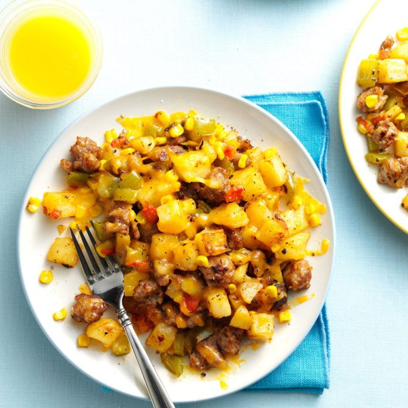

<head>
</title>External Style Sheet</title>
<head>
<body>
 <link rel="food" href="food.css">
<h1>Bratwurst Hash Recipe</h1>

  <h2>Ingredients</h2>  
  <ul>
 <li>4 Uncooked Bratwurst links</li>
 <li>1 Medium Green Pepper</li>
 <li>20 oz of Diced Potatoes w/ Onions</li>
 <li>1 Cup of Frozen Corn</li>
 <li>1/4 of Chopped Roasted Sweet Red Pepper</li>
 <li>1/2 Teaspoon of Seasoned Salt</li>
 <li>3/4 Cup of Shredded Colby-Monterey Jack Cheese</li>
